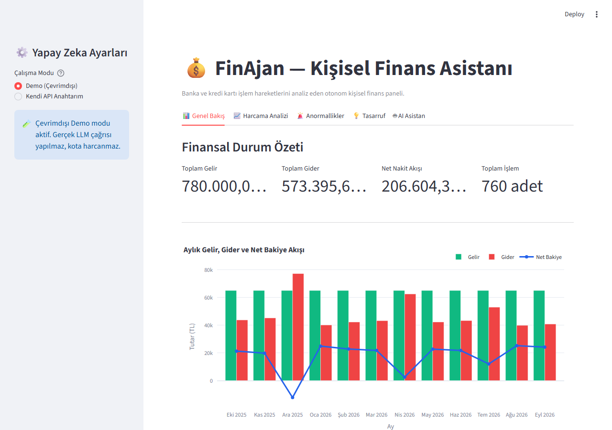
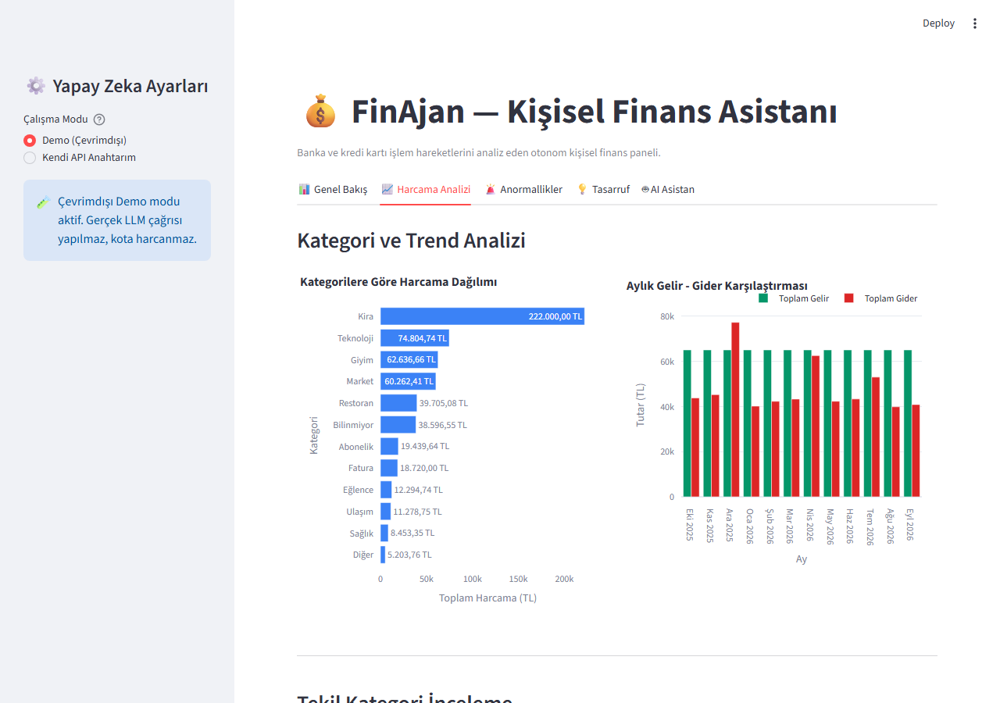
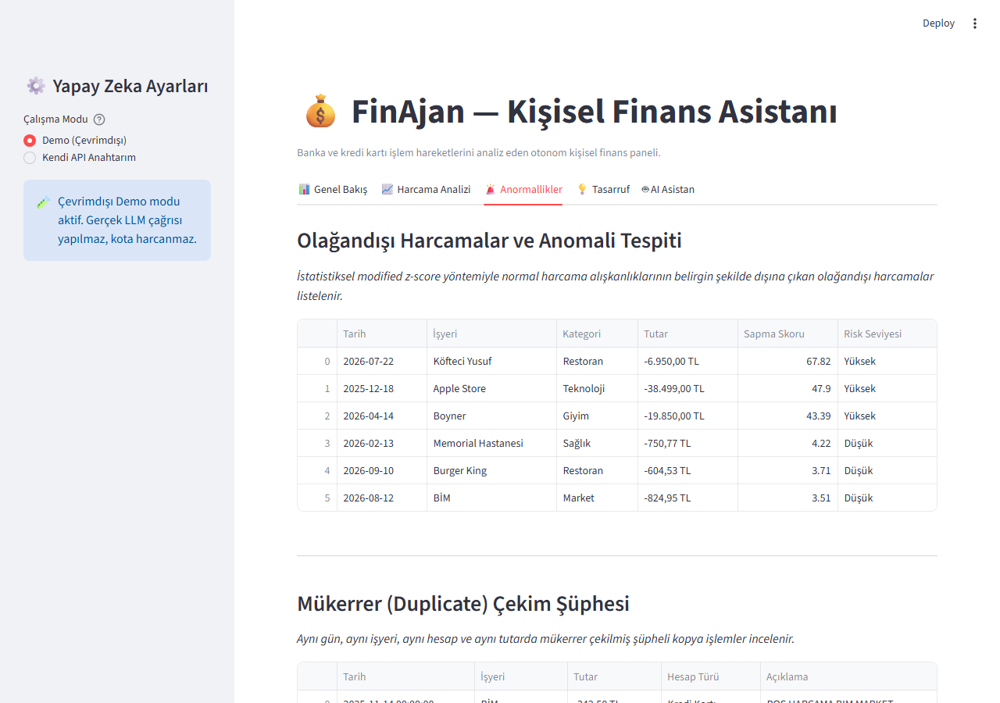
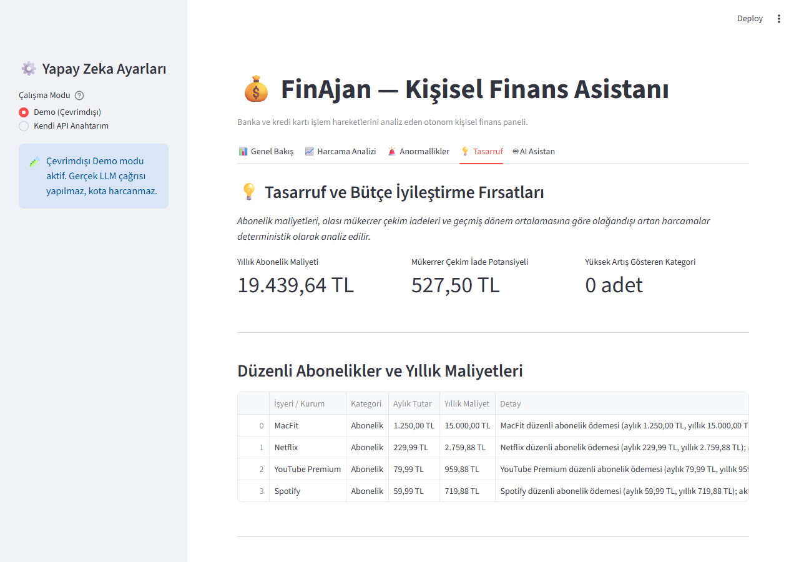
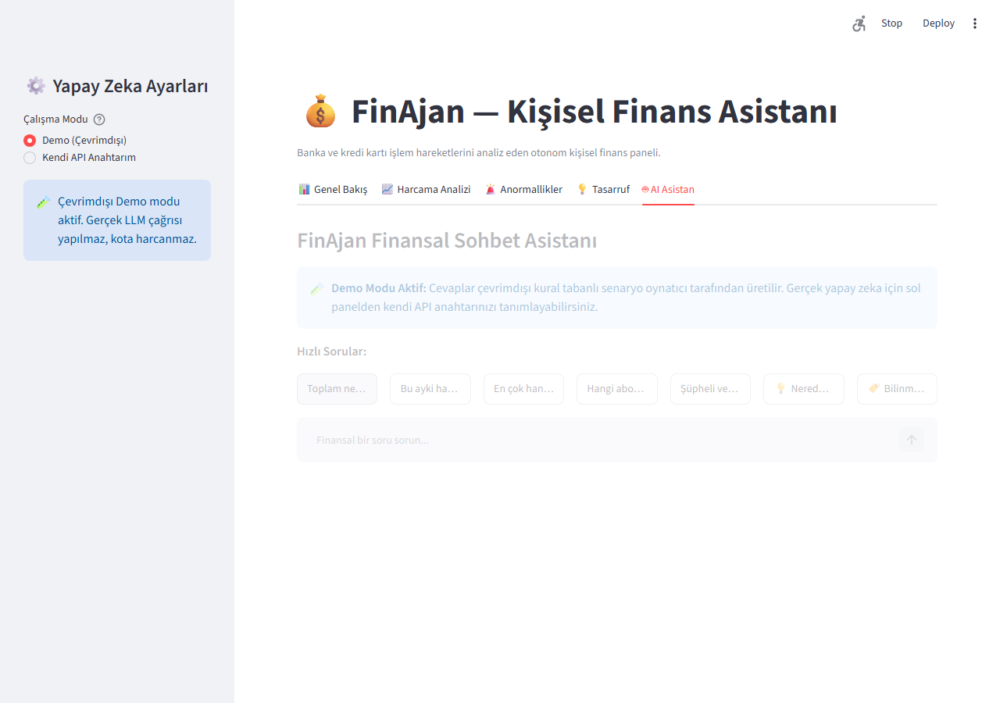
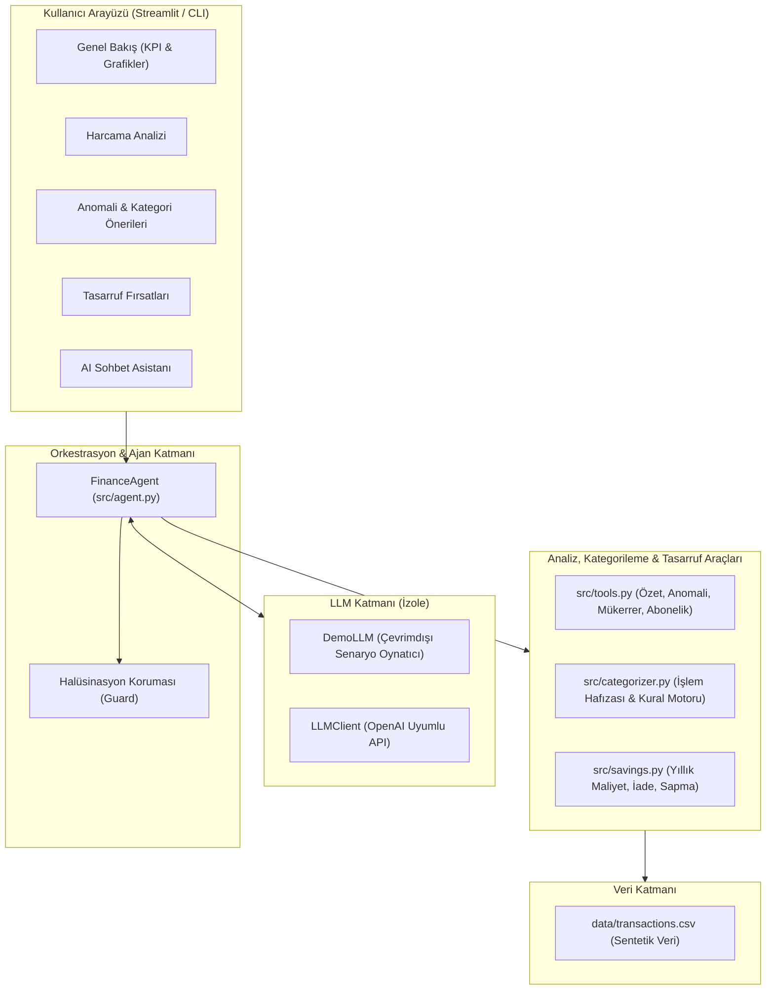

# 💰 FinAjan — Kişisel Finans Asistanı & Analiz Paneli

FinAjan, kullanıcıların banka hesap ve kredi kartı işlem hareketlerini analiz eden, harcama alışkanlıklarını özetleyen, istatistiksel anomali ve mükerrer çekimleri tespit eden ve yapay zeka destekli sohbet asistanı sunan yerel bir kişisel finans uygulamasıdır.

İnternet bağlantısı veya API anahtarı olmadan çalışan **Çevrimdışı Demo Modu** sayesinde repoyu klonlayan herkes uygulamayı anında deneyimleyebilir.

---

## 📸 Ekran Görüntüleri

| 1. Genel Bakış ve Finansal Trend | 2. Harcama Analizi & Kategori Dağılımı |
|:---:|:---:|
|  |  |
| **3. Anormallikler & Kategori Önerileri** | **4. Tasarruf Fırsatları & Abonelikler** |
|  |  |
| **5. AI Sohbet Asistanı** | |
|  | |

---

## 🏛️ Sistem Mimarisi

FinAjan'da LLM sayı üretmez ve matematiksel/finansal hesaplama yapmaz; tüm finansal metrikler deterministik saf Python fonksiyonları tarafından hesaplanır. Ajanın ürettiği cevaplar, araç çıktılarındaki verilerle çapraz denetlenir (halüsinasyon koruması).



---

## 🎯 Çalışma Modları

1. **🧪 Demo Modu (Çevrimdışı):**
   - API anahtarı veya internet bağlantısı gerektirmez.
   - Kural tabanlı senaryo oynatıcı (`DemoLLM`) arka planda çalışarak gerçek analiz araçlarını tetikler.
   - Doğrulanmış finansal özetler ve anomali raporları üretir.

2. **🤖 Gerçek LLM Modu (OpenAI Uyumlu API):**
   - Groq, Google Gemini (OpenAI uç noktası), OpenRouter veya yerel LLM modelleriyle (Ollama, vLLM vb.) çalışır.
   - Ajan otonom araç çağırma (Tool Calling) döngüsüyle kullanıcı sorularını yanıtlar.
   - Çıktılar halüsinasyon korumasıyla denetlenir.

---

## 📋 Veri Sözleşmesi

- **Tutar İşareti Kuralı:**
  - **GELİR POZİTİF:** Maaş, prim vb. gelir kalemleri artı işaretlidir (örn. `+65.000,00 TL`).
  - **GİDER NEGATİF:** Tüm harcama, fatura, kira ve abonelikler eksi işaretlidir (örn. `-18.500,00 TL`).
  - Hesaplama fonksiyonlarında giderler mutlak büyüklük olarak toplanır; bakiye ise cebirsel net toplamdır (`Net = Gelir + Gider`).
- **Veri Şeması (`data/transactions.csv`):**
  - `tarih`: `YYYY-MM-DD`
  - `tutar`: 2 ondalıklı float
  - `aciklama`: Banka hareket metni
  - `isyeri`: Standartlaştırılmış işyeri / kurum
  - `kategori`: 12 standart kategori (`Gelir`, `Kira`, `Fatura`, `Abonelik`, `Market`, `Restoran`, `Ulaşım`, `Giyim`, `Eğlence`, `Sağlık`, `Teknoloji`, `Diğer`, `Bilinmiyor`)
  - `hesap`: `Vadesiz Hesap` veya `Kredi Kartı`
- **Referans Tarih:** Deterministik analiz için sabit referans tarihi `2026-09-30` olarak tanımlıdır.

---

## 🚀 Hızlı Başlangıç

### Gereksinimler
- Python 3.12 (önerilir)
- PowerShell (Windows) veya Bash (Linux/macOS)

### 1. Depoyu Klonlayın ve Bağımlılıkları Kurun

```powershell
# Depoyu klonlayın
git clone https://github.com/kullaniciadi/finajan.git
cd finajan

# Sanal ortamı oluşturun ve etkinleştirin
python -m venv .venv
.\.venv\Scripts\Activate.ps1   # Linux/macOS için: source .venv/bin/activate

# Bağımlılıkları yükleyin
pip install -r requirements.txt
```

### 2. Sentetik Veriyi Üretin (İsteğe Bağlı)
Depo varsayılan olarak hazır `data/transactions.csv` verisiyle gelir. Yeniden üretmek için:
```powershell
python data/generate_data.py
```

### 3. Uygulamayı Başlatın

```powershell
# Web Arayüzü (Streamlit)
streamlit run app.py

# Komut Satırı Arayüzü (CLI)
python chat_cli.py
```

---

## 🔑 Kendi API Anahtarınızı Ekleme

Gerçek LLM modunu kullanmak isterseniz iki farklı yöntem mevcuttur:

1. **Arayüz Üzerinden (Önerilen):**
   - Streamlit sol panelindeki "Yapay Zeka Ayarları" menüsünden "Kendi API Anahtarım" seçeneğini belirleyin.
   - Sağlayıcınızı seçip (Groq, Gemini vb.) anahtarınızı girin.
   - *Not: Anahtarınız diske kaydedilmez, yalnızca oturum süresince tarayıcı belleğinde tutulur.*

2. **`.env` Dosyası İle:**
   - Proje kökünde `.env` dosyası oluşturun (`.env.example` dosyasını örnek alabilirsiniz):
   ```env
   LLM_API_KEY=gsk_sizin_groq_anahtariniz
   LLM_BASE_URL=https://api.groq.com/openai/v1
   LLM_MODEL=openai/gpt-oss-120b
   ```

### Ücretsiz Sağlayıcı Alternatifleri
- **Groq Cloud:** [console.groq.com](https://console.groq.com) üzerinden ücretsiz ve hızlı API anahtarı temin edilebilir (`LLM_BASE_URL=https://api.groq.com/openai/v1`).
- **Google Gemini:** Google AI Studio üzerinden OpenAI uyumlu uç nokta ile ücretsiz kullanılabilir (`https://generativelanguage.googleapis.com/v1beta/openai/`).
- **Yerel LLM:** Ollama veya LM Studio çalıştırılarak `http://localhost:11434/v1` adresiyle tamamen cihaz üzerinde internete çıkmadan çalıştırılabilir.

---

## 💬 Örnek Sorular

- *"Toplam ne kadar harcama yaptım ve net bakiyem ne kadar?"*
- *"Bu ayki harcama durumum nedir?"*
- *"En çok hangi kategoride harcama yaptım?"*
- *"Hangi aboneliklerim ve düzenli ödemelerim var?"*
- *"Şüpheli veya mükerrer çekilmiş işlem var mı?"*
- *"Nereden tasarruf edebilirim?" (Abonelik, mükerrer çekim ve sapma analizi)*
- *"Bilinmeyen işlemleri kategorilendir" (İşyeri kural motoruyla kategori önerileri)*

---

## 🧪 Testleri Çalıştırma

Tüm birim, orkestrasyon, arayüz (AppTest) ve demo testleri tek bir komutla yürütülür:

```powershell
$env:PYTHONUTF8="1"
pytest -q
```

---

## 🔒 Güvenlik & Gizlilik Prensipleri

- **Secret İzolasyonu:** API anahtarları asla kod içine, loglara, ekran görüntülerine veya git geçmişine yazılmaz. `.env` dosyası `.gitignore` ile korunur.
- **Sentetik Veri:** Projede kullanılan tüm finansal hareketler, işyerleri ve tutarlar sentetiktir (`Faker` ve deterministik tohumlama ile üretilmiştir).
- **Gerçek Veri Güvenliği:** Gerçek banka ekstresi veya kişisel finans verisi ile çalışılacaksa yerel bir model (Ollama / LocalAI) veya özel bulut uç noktası kullanılması önerilir.

---

## ⚠️ Sınırlamalar ve Doğruluk Değerlendirmesi

1. **Halüsinasyon Koruması:** Tarih günleri (1-31 arası tam sayılar), takvim yılları (2000-2099) ve bazı serbest yüzde biçimleri doğal dilde cümle akışını bozmamak adına koruma filtresine takılmaz; yalnızca araç çıktılarında yer alan kesin finansal tutarlar ve net metrikler çapraz doğrulanır.
2. **Kategorileme Doğruluğu ve Yöntem Ölçümleri:**
   - *Varsayılan Durum (Bellek + Sözlük):* Sentetik veri setindeki 114 "Bilinmiyor" işlemin 114'ü (%100) bellek yöntemiyle çözülmüştür; zira aynı sentetik veri setindeki işyerleri geçmiş aylarda tek bir kategori altında görülmüştür.
   - *Yalnızca Sözlük (Bellek Kapalı):* Bellek devre dışı bırakıldığında 114 işlem üzerinde sözlük kapsama oranı **%92,98** (106/114 öneri), sözlük doğruluk oranı ise **%89,62** (95/106 doğru tahmin) olarak ölçülmüştür.
   - *Hold-out Testi (Veri Setinde ve Sözlükte Olmayan 10 Türk İşyeri):* Gerçek hayat simülasyonu amacıyla kurulan bağımsız test setinde sözlük kapsamı **%40,00** (4/10), eşleşenlerde doğruluk **%100,00** (4/4) çıkmıştır. Eşleşmeyen 6 işyerinde yanlış tahmin yapılmamış; sistem güvenli biçimde *"öneri yok"* (`guven: "dusuk"`, `yontem: "yok"`) dönmüştür.
3. **Tasarruf Önerileri ve Sapma Notu:** Asla farazi genel bir tasarruf tutarı uydurulmaz; yalnızca tespit edilen gerçek aboneliklerin yıllık maliyetleri, mükerrer tahsilatlar ve son ayda ortalamanın %30 üzerine çıkan kategoriler kullanıcıya sunulur. Sentetik test veri setinde harcamalar dengeli seyrettiği için son ay sapma kartı **0 adet** (boş) dönebilmektedir.
4. **Sentetik Veri Karakteri:** Veri seti kontrollü anomali ve abonelik örüntüleri içerecek şekilde algoritmik olarak kurgulanmıştır.
5. **Deterministik Zaman:** Veri setinin son ayı olan `2026-09` dönemi "güncel ay" kabul edilir.

---

## 🗺️ Yol Haritası

- [x] Faz 1: Sentetik Veri Üreticisi ve Saf Analiz Araçları
- [x] Faz 2: Ajan Orkestrasyonu, Tool Calling ve Halüsinasyon Koruması
- [x] Faz 2B: OpenAI / Groq Uyumlu API Geçişi
- [x] Faz 3: Streamlit Arayüzü, Çevrimdışı Demo Modu ve GitHub Hazırlığı
- [x] Faz 4: Eksik Yetenekler (Kategorileme, Tasarruf Fırsatları) ve Yayın Temizliği
- [x] Faz 4.1: Doğrulama, Hold-out Testleri ve Yayın Öncesi Hijyen
- [ ] Faz 5: PDF Ekstre Yükleme (OCR ve Banka Formatları Desteği)
- [ ] Faz 6: Kişiselleştirilmiş Bütçe Hedefleri ve Bildirim Sistemi

---

## 📄 Lisans

Bu proje [MIT Lisansı](LICENSE) altında sunulmaktadır. (Copyright (c) 2026 ŞAHAPOĞUZ ALŞAN)
